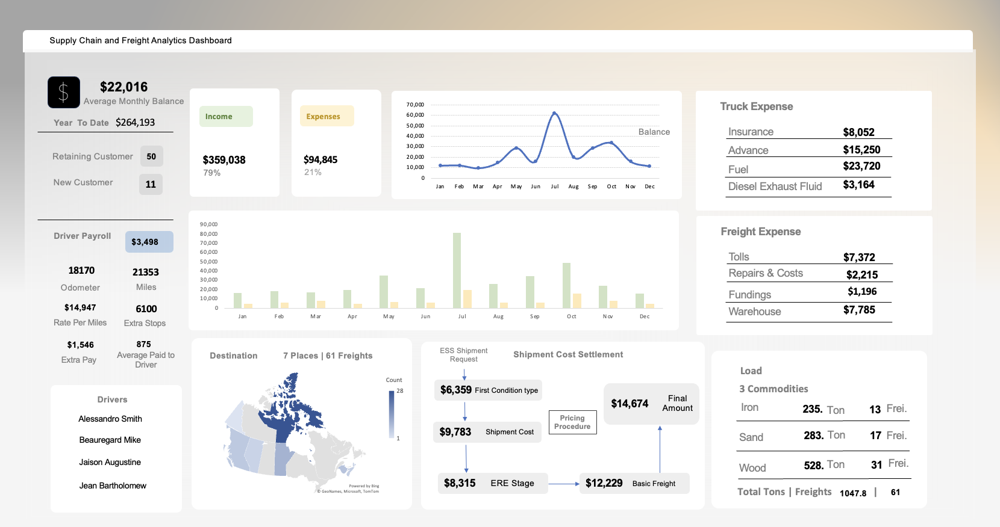

# Supply-Chain-and-Freight-Analytics-MsExcel

# Supply Chain and Freight Analytics Using Excel

## Overview

The primary goal of the Supply Chain and Freight Analytics Using Excel project is to demonstrate the effective use of Excel for analyzing freight data to enhance supply chain operations. 

## Dataset Description

The dataset includes detailed freight information, capturing key aspects of supply chain operations over several months. Here’s a brief overview of the columns included:

- **Month/Day**: Date of shipment.
- **Load**: Type of material being shipped (e.g., wood, sand, iron).
- **Tonnage**: Weight of the shipment.
- **Customer Type**: Classification of the customer (e.g., retaining or new).
- **Destination**: Geographic location of the shipment.
- **Rate**: Revenue generated from the shipment.
- **Truck**: Type of truck used for transportation.
- **Expenses**: Various costs associated with the shipment, including insurance, fuel, tolls, and driver costs.
- **Total Expenses**: The total cost incurred for each shipment.
- **Final Amount**: Profit or loss from the shipment.

## Project Steps

1. **Data Cleaning**: Cleaning the raw freight data to ensure accuracy and consistency, enabling reliable analysis.
2. **Data Analysis**: Performing analyses to uncover trends, insights, and patterns in freight operations.
3. **Pivot Tables**: Utilizing pivot tables to summarize and visualize key metrics, making it easier to understand complex datasets.
4. **Dashboard Creation**: Building interactive dashboards within Excel to provide stakeholders with at-a-glance insights into freight performance and financial metrics.
   
## Screenshot

