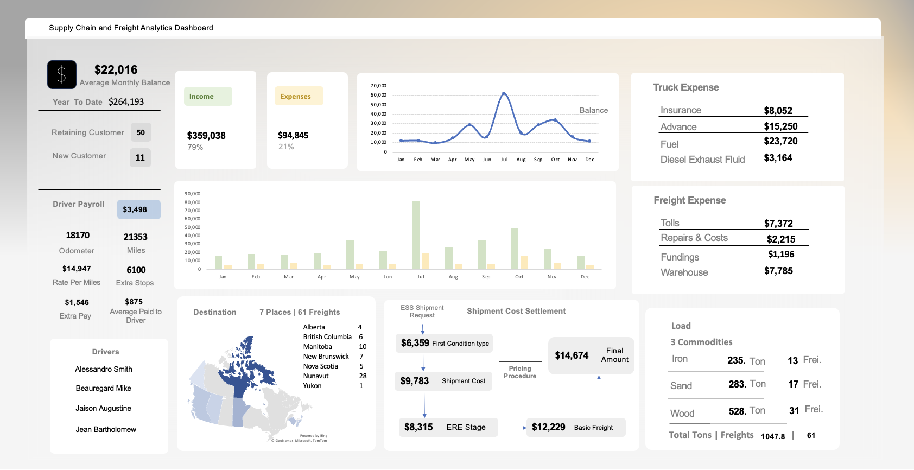

# Supply Chain and Freight Analytics Using Excel

## Overview

The primary goal of this Supply Chain and Freight Analytics project is to demonstrate the effective use of Excel for analyzing supply chain, and freight data to enhance supply chain operations. 

## Dataset Description

The dataset includes detailed freight information, capturing key aspects of supply chain operations over several months. Here’s a brief overview of the columns included:

- **Month/Day**: Date of shipment.
- **Load**: Type of material being shipped (e.g., wood, sand, iron).
- **Tonnage**: Weight of the shipment.
- **Customer Type**: Classification of the customer (e.g., retaining or new).
- **Destination**: Geographic location of the shipment.
- **Rate**: Revenue generated from the shipment.
- **Truck**: Type of truck used for transportation.
- **Expenses**: Various costs associated with the shipment, including insurance, fuel, tolls, and driver costs.
- **Total Expenses**: The total cost incurred for each shipment.
- **Final Amount**: Profit or loss from the shipment.

## Project Steps

1. **Data Cleaning**: Cleaning the raw freight data to ensure accuracy and consistency, enabling reliable analysis.
2. **Data Analysis**: Performing analyses to uncover trends, insights, and patterns in freight operations.
3. **Pivot Tables**: Utilizing pivot tables to summarize and visualize key metrics, making it easier to understand complex datasets.
4. **Dashboard Creation**: Building interactive dashboards within Excel to provide stakeholders with at-a-glance insights into freight performance and financial metrics.
   
## Screenshot

## Insights and Inferences

### Customer Insights
- **Retention vs. Acquisition**: The significant difference in the number of retaining customers (50) compared to new customers (11) suggests strong customer loyalty. Existing customers appear satisfied, indicating a need for targeted efforts to attract new clients.

### Profitability Trends
- **Monthly Profitability Variance**: July stands out as the highest profitable month, indicating potential seasonal demand or effective marketing strategies. Analyzing the factors behind this spike could help replicate success in other months.
- **Overall Profitability**: Total income of $359,038 against total expenses of $98,485 results in a substantial profit. This indicates positive operational performance, but there is still room for improvement.

### Operational Insights
- **Freight Composition**: The variety of commodities shipped shows wood is the most frequently transported material (528 tons over 31 freights). Optimizing this segment could yield better results.
- **Geographic Distribution**: Shipments span seven destinations, with Nunavut receiving the most (28). Understanding costs and revenues per destination can identify profitable routes.

### Expense Analysis
- **Truck Expenses**: Major costs stem from fuel ($23,720) and insurance ($8,052). Exploring fuel-efficient transportation or renegotiating insurance could lead to savings.
- **Monthly Income vs. Expenses**: Fluctuations in income and expenses indicate potential inefficiencies. For example, July’s income peaks without a proportional increase in expenses.

### Payroll Insights
- **Driver Payroll**: The average driver pay of $875 and total payroll of $3,498 necessitate assessment to ensure competitiveness in retaining skilled drivers.

### Strategic Recommendations
- **Enhanced Data Analytics**: Employ advanced analytics to explore correlations between customer types, freight types, and profitability.
- **Focus on High-Performing Months**: Investigate July’s success factors to enhance revenue in slower months.

## Financial Summary
- **Total Income**: $359,038
- **Total Expenses**: $98,485
- **Average Monthly Balance**: $22,016
- **Year-to-Date Total Balance**: $264,193

These inferences can guide decision-making processes to enhance operational efficiency, improve profitability, and strengthen customer relationships in the supply chain and freight management context.
